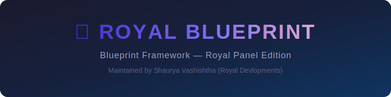

<div align="center">
  
  <br><br>

  [](https://github.com/royaldevlopments/blueprint-framework/releases)
  [](https://php.net)
  [](https://nodejs.org)
  [](LICENSE.md)
  [](https://pterodactyl.io)

  <h3>🔧 Blueprint Framework Fork — Arix Theme Compatible</h3>
  <p>Specially built for <strong>Royal Panel</strong> by <strong>Shaurya Vashishtha (Royal Devlopments)</strong></p>
</div>

---

## 📋 What is Royal Blueprint?

A fully **Arix Theme-compatible** version of Blueprint Framework. Install extensions on your Pterodactyl/Royal Panel **without breaking your Arix theme**.

No manual file merging. No white screens. No conflicts.

## ✨ Features

| Feature | Description |
|---------|-------------|
| 🎯 **Auto-detection** | Detects Arix Theme during install |
| 🔄 **Zero merging** | Restores Arix React components, templates & config automatically |
| 🔌 **Blueprint extensions** | Install/uninstall extensions normally |
| 🧩 **Directive merge** | All `@include`/`@yield` directives auto-added to Arix templates |
| 🧹 **Clean branding** | No conflicts — Royal Panel ready |

## 🚀 Installation

```bash
# Extract release over your panel root
unzip release.zip -d /var/www/pterodactyl

# Run installer — Arix compatibility handled automatically
bash blueprint.sh
```

That's it. The installer detects Arix, restores your theme files, merges Blueprint directives, and builds everything clean.

## 📦 Requirements

- ✅ Pterodactyl/Royal Panel with **Arix Theme v2.x** installed
- ✅ PHP **8.0+**
- ✅ Node.js **22+**
- ✅ MariaDB / MySQL

## 👑 Maintainer

**Shaurya Vashishtha** — Royal Devlopments

---

<div align="center">
  <sub>Based on <a href="https://github.com/blueprintframework/framework">Blueprint Framework</a> — modified for Royal Panel compatibility</sub>
</div>
